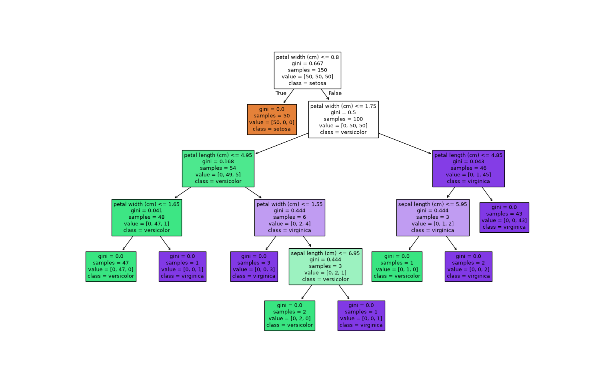
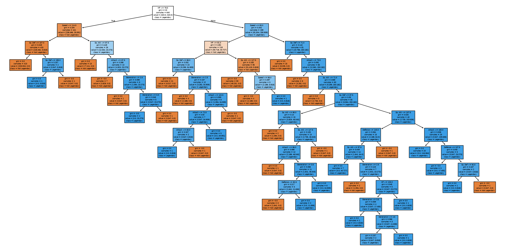

# Decision Trees

This section of my machine learning journey focuses on **Decision Trees for classification** using Python and Scikit-learn.

The main project uses a **Pokémon dataset with 800 Pokémon** to predict whether a Pokémon is **Legendary** based on its stats and generation.

## What is a Decision Tree?

A Decision Tree is a supervised machine learning algorithm that makes predictions by learning a series of decision rules from the training data.

Conceptually:

```text
              Attack > 100?
               /          \
             Yes           No
             /              \
        Legendary       Not Legendary
```

The tree repeatedly splits the data into smaller groups until it reaches a prediction.

## Dataset

The Pokémon dataset contains information such as:

* HP
* Attack
* Defense
* Special Attack
* Special Defense
* Speed
* Generation
* Legendary

For this project:

### Features (`X`)

```python
X = df[[
    "HP",
    "Attack",
    "Defense",
    "Sp. Atk",
    "Sp. Def",
    "Speed",
    "Generation"
]]
```

### Target (`y`)

```python
y = df["Legendary"]
```

The model predicts:

```text
False → Not Legendary
True  → Legendary
```

`Total` was intentionally excluded because it is derived from the six individual battle stats. Including it when predicting `Total` would cause data leakage.

## Train/Test Split

The dataset was divided into training and testing sets:

```python
X_train, X_test, y_train, y_test = train_test_split(
    X,
    y,
    test_size=0.2,
    random_state=42
)
```

This creates:

```text
80% → Training data
20% → Testing data
```

## Training the Model

```python
from sklearn import tree

clf = tree.DecisionTreeClassifier()

clf.fit(X_train, y_train)
```

The tree learns decision rules from the training data.

## Making Predictions

```python
y_pred = clf.predict(X_test)
```

The model then predicts whether each Pokémon in the test set is Legendary.

## Decision Tree Visualization

The trained tree can be visualized using:

```python
import matplotlib.pyplot as plt

plt.figure(figsize=(20, 12))

tree.plot_tree(
    clf,
    feature_names=X.columns,
    class_names=["Not Legendary", "Legendary"],
    filled=True
)

plt.show()
```

Each node contains information such as:

* **Gini** — measures how mixed the classes are
* **Samples** — number of training samples reaching the node
* **Value** — number of samples belonging to each class
* **Class** — the class predicted at that node

## Gini Impurity

For classification, the Decision Tree can use Gini impurity to determine how good a split is.

The formula is:

$$
Gini = 1 - \sum_{i=1}^{C}p_i^2
$$

where \(p_i\) is the proportion of samples belonging to class \(i\).

A Gini value of:

```text
0 → completely pure node
```

means all samples belong to one class.

A higher Gini value means the classes are more mixed.

## Model Evaluation

Because this is a classification problem, several metrics were used.

### Accuracy

```python
from sklearn.metrics import accuracy_score

accuracy = accuracy_score(y_test, y_pred)

print("Accuracy Score:", accuracy)
```

Accuracy measures the proportion of correct predictions.

However, accuracy alone can be misleading because the Pokémon dataset contains significantly more non-Legendary Pokémon than Legendary Pokémon.

### Classification Report

```python
from sklearn.metrics import classification_report

print(classification_report(y_test, y_pred))
```

This provides:

* Precision
* Recall
* F1-score
* Support

### Confusion Matrix

A confusion matrix contains:

```text
True Positive
True Negative
False Positive
False Negative
```

For this project:

```text
Positive → Legendary
Negative → Not Legendary
```

|                      | Predicted Not Legendary | Predicted Legendary |
| -------------------- | ----------------------: | ------------------: |
| Actual Not Legendary |                      TN |                  FP |
| Actual Legendary     |                      FN |                  TP |

These four values are the foundation of many classification metrics.

## Class Imbalance

The dataset contains many more non-Legendary Pokémon than Legendary Pokémon.

This means a model can achieve high accuracy while still performing poorly at detecting Legendary Pokémon.

For example, a model that predicts `False` for almost everything can achieve high accuracy simply because `False` is the majority class.

To investigate this, `class_weight="balanced"` was tested:

```python
clf = tree.DecisionTreeClassifier(
    class_weight="balanced",
    random_state=42
)
```

This gives more importance to the minority class during training.

The experiment showed the tradeoff between:

* Accuracy
* Precision
* Recall
* F1-score

## Model Complexity

Decision Trees can easily become too complex and overfit the training data.

The `max_depth` parameter can be used to control tree complexity:

```python
clf = tree.DecisionTreeClassifier(
    max_depth=3,
    random_state=42
)
```

A shallow tree may underfit, while an extremely deep tree may overfit.

The goal is to find a useful balance.

## Key Things Learned

* How Decision Trees make predictions
* How to train a `DecisionTreeClassifier`
* How to use train/test splits
* How to make predictions with `.predict()`
* How Gini impurity works
* What `samples`, `value`, and `class` mean
* How to visualize a Decision Tree
* How to evaluate classification models
* Accuracy vs precision vs recall vs F1
* How to interpret a confusion matrix
* Why class imbalance matters
* How `class_weight="balanced"` affects classification
* How model complexity can cause overfitting

## Basic Workflow

```text
Pokémon Dataset
      ↓
Select Features and Target
      ↓
Train/Test Split
      ↓
Decision Tree
      ↓
Train Model
      ↓
Make Predictions
      ↓
Evaluate Model
      ├── Accuracy
      ├── Precision
      ├── Recall
      ├── F1-score
      └── Confusion Matrix
      ↓
Analyze Overfitting & Class Imbalance
```

## Decision Tree Visualization



## Decision Tree on Pokemon database

