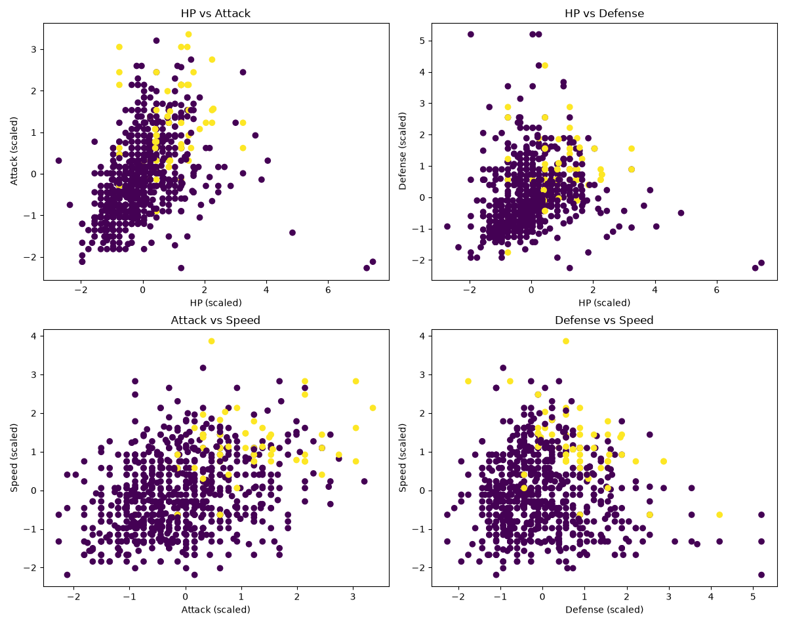

# K-Nearest Neighbors (KNN)

## What is K-Nearest Neighbors?

**K-Nearest Neighbors (KNN)** is a supervised machine learning algorithm that makes predictions by looking at the **K closest data points** to a new data point.

The basic idea is:

> **Similar data points tend to have similar outputs.**

For classification:

```text
New data point
      ↓
Calculate distances
      ↓
Find K nearest neighbors
      ↓
Look at their labels
      ↓
Majority vote
      ↓
Prediction
```

## 1. The Friends Analogy

A simple way to understand KNN:

> **Tell me who your closest friends are, and I'll make a guess about you based on their behavior.**

If the 3 closest students are:

```text
Pass
Pass
Fail
```

then the majority vote is:

```text
Prediction = Pass
```

KNN applies the same idea to numerical data.

## 2. What Does K Mean?

`K` is the number of nearest neighbors considered.

```python
KNeighborsClassifier(n_neighbors=5)
```

means:

> Look at the 5 closest training examples.

For example:

```text
Pass
Pass
Fail
Pass
Fail
```

The result is:

```text
Pass = 3
Fail = 2

Prediction = Pass
```

## 3. How Does KNN Find the Nearest Points?

KNN needs a way to measure distance.

The most common distance you'll encounter is **Euclidean distance**.

For two points:

```text
A = (x₁, y₁)
B = (x₂, y₂)
```

the distance is:

\[
d(A,B)=\sqrt{(x_2-x_1)^2+(y_2-y_1)^2}
\]

Example:

```text
A = (2, 3)
B = (5, 7)
```

\[
d=\sqrt{(5-2)^2+(7-3)^2}
\]

\[
=\sqrt{3^2+4^2}
\]

\[
=5
\]

So the distance is `5`.

For many features:

\[
d=\sqrt{\sum_{i=1}^{n}(x_i-y_i)^2}
\]

Every feature contributes to the distance.

## 4. How KNN Makes a Classification

Suppose a new Pokémon arrives.

KNN:

```text
New Pokémon
     ↓
Calculate distance to training Pokémon
     ↓
Sort distances
     ↓
Take K closest Pokémon
     ↓
Look at their labels
     ↓
Majority vote
     ↓
Prediction
```

With `K = 5`:

```text
Neighbor 1 → Legendary
Neighbor 2 → Legendary
Neighbor 3 → Not Legendary
Neighbor 4 → Legendary
Neighbor 5 → Not Legendary
```

Votes:

```text
Legendary     = 3
Not Legendary = 2
```

Prediction:

```text
Legendary
```

So the core of KNN classification is:

> **Distance → Neighbors → Vote → Prediction**

## 5. Classification vs Regression

KNN can perform both.

### Classification

Predict a category:

```text
Legendary / Not Legendary
Spam / Not Spam
Pass / Fail
Cat / Dog
```

```python
from sklearn.neighbors import KNeighborsClassifier
```

### Regression

Predict a numerical value:

```text
House price → ₹55 lakh
Temperature → 27.4
Pokémon HP → 92
```

```python
from sklearn.neighbors import KNeighborsRegressor
```

The difference:

```text
KNN Classification
        ↓
Majority vote

KNN Regression
        ↓
Numerical prediction
```

## 6. Why Feature Scaling Matters

KNN relies on **distance**, so feature scale matters.

Imagine:

```text
Age     → 18–60
Salary  → 20,000–2,000,000
```

Salary has a much larger numerical scale and can dominate distance calculations.

So we commonly scale features:

```python
from sklearn.preprocessing import StandardScaler

scaler = StandardScaler()

X_train_scaled = scaler.fit_transform(X_train)
X_test_scaled = scaler.transform(X_test)
```

Remember:

```text
Feature scaling
→ Put features on comparable scales

Feature selection
→ Decide which features to keep
```

Scaling does not mean simply deleting large numbers.

### Avoid data leakage

Correct:

```python
X_train_scaled = scaler.fit_transform(X_train)
X_test_scaled = scaler.transform(X_test)
```

Do not fit the scaler separately on the test data:

```python
X_test_scaled = scaler.fit_transform(X_test)  # Wrong
```

The scaler should learn its parameters from the training data only.

## 7. Choosing K

### Small K

For example:

```python
KNeighborsClassifier(n_neighbors=1)
```

The prediction depends heavily on individual points.

```text
Small K
   ↓
Very local decisions
   ↓
Sensitive to noise
   ↓
Possible overfitting
```

### Large K

```python
KNeighborsClassifier(n_neighbors=50)
```

Many points influence the prediction.

```text
Large K
   ↓
Smoother decisions
   ↓
Local patterns can be ignored
   ↓
Possible underfitting
```

So `K` is a hyperparameter that needs to be chosen carefully.

## 8. Weighted KNN

Normal KNN gives neighbors equal influence:

```python
KNeighborsClassifier(
    n_neighbors=5,
    weights="uniform"
)
```

You can instead give closer neighbors more influence:

```python
KNeighborsClassifier(
    n_neighbors=5,
    weights="distance"
)
```

Conceptually:

```text
Very close neighbor
       ↓
More influence

Farther neighbor
       ↓
Less influence
```

## 9. KNN With Pokémon Data

For the Pokémon project, we can predict whether a Pokémon is Legendary using its stats.

```python
X = df[
    [
        "HP",
        "Attack",
        "Defense",
        "Speed"
    ]
]

y = df["Legendary"]
```

Here:

```text
X → Pokémon statistics
y → Legendary / Not Legendary
```

Because `Legendary` contains classes (`True` / `False`), this is a **classification problem**.

Therefore:

```python
KNeighborsClassifier
```

## 10. Basic KNN Implementation

```python
from sklearn.neighbors import KNeighborsClassifier
from sklearn.model_selection import train_test_split
from sklearn.preprocessing import StandardScaler

import pandas as pd

df = pd.read_csv("../04-data-science/data-bases/pokemon.csv")

X = df[
    [
        "HP",
        "Attack",
        "Defense",
        "Speed"
    ]
]

y = df["Legendary"]

X_train, X_test, y_train, y_test = train_test_split(
    X,
    y,
    test_size=0.2,
    random_state=42,
    stratify=y
)

scaler = StandardScaler()

X_train_scaled = scaler.fit_transform(X_train)
X_test_scaled = scaler.transform(X_test)

model = KNeighborsClassifier(
    n_neighbors=5
)

model.fit(X_train_scaled, y_train)

y_pred = model.predict(X_test_scaled)

accuracy = model.score(
    X_test_scaled,
    y_test
)

print("Accuracy:", accuracy)
```

## KNN Pokemon Attack VS Speed



## 11. Why `stratify=y`?

The Pokémon dataset is imbalanced:

```text
False → 735
True  → 65
```

That's approximately:

```text
False → 91.9%
True  → 8.1%
```

Using:

```python
stratify=y
```

keeps approximately the same class proportions in the training and test sets.

It **does not remove the imbalance**. It just makes the split more representative.

## 12. Class Imbalance

Because most Pokémon are non-Legendary, accuracy can be misleading.

A model that predicts `False` for every Pokémon would get:

\[
735/800=91.875\%
\]

accuracy on this dataset.

So:

> **High accuracy does not automatically mean the model is good.**

Use other metrics too:

- Precision
- Recall
- F1-score
- Confusion matrix

## 13. Precision, Recall and F1

### Precision

Of the Pokémon predicted as Legendary, how many were actually Legendary?

\[
Precision=rac{TP}{TP+FP}
\]

### Recall

Of all the Pokémon that were actually Legendary, how many did the model find?

\[
Recall=rac{TP}{TP+FN}
\]

### F1-score

Combines precision and recall:

\[
F1=2rac{Precision	imes Recall}{Precision+Recall}
\]

For this Pokémon problem, **Legendary recall** is particularly useful if the goal is to find as many Legendary Pokémon as possible.

## 14. Classification Report

```python
from sklearn.metrics import classification_report

print(classification_report(y_test, y_pred))
```

This gives precision, recall, F1-score, and support for each class.

A model can have high overall accuracy while still having poor recall for the minority class.

## 15. Visualizing KNN

If the model uses four features:

```text
HP
Attack
Defense
Speed
```

the data exists in four-dimensional feature space.

A normal graph can directly show only two dimensions.

For example:

```python
plt.scatter(
    X_scaled[:, 1],  # Attack
    X_scaled[:, 3],  # Speed
    c=y
)
```

This gives an **Attack vs Speed** visualization while the actual model can still use all four features.

The graph is therefore a simplified visualization, not a complete visualization of the four-dimensional model.

## 16. KDTree

You may encounter:

```python
from sklearn.neighbors import KDTree
```

A KDTree is **not a different prediction algorithm**.

It is a data structure that can organize points to make nearest-neighbor searches more efficient.

Conceptually:

```text
KNN
 ↓
Need to find nearest points
 ↓
Possible search methods
 ├── Brute force
 ├── KDTree
 └── BallTree
```

So:

```text
KNN
→ prediction method

KDTree
→ data structure/search method
```

You don't need to master KDTree to understand the core KNN algorithm.

## 17. Complete Mental Model

```text
             New Data Point
                    ↓
          Calculate Distances
                    ↓
          Sort by Distance
                    ↓
          Choose K Neighbors
                    ↓
             Look at Labels
                    ↓
              Majority Vote
                    ↓
               Prediction
```

The core idea:

> **Find the closest examples and use them to make the prediction.**

The harder parts are deciding:

```text
Which features should we use?
        ↓
Should we scale them?
        ↓
What value of K should we use?
        ↓
Should neighbors be weighted?
        ↓
How should we evaluate the predictions?
```

## 18. KNN Cheat Sheet

```text
KNN
│
├── Supervised Learning
│
├── Classification
│   └── KNeighborsClassifier
│
├── Regression
│   └── KNeighborsRegressor
│
├── Main idea
│   └── Find nearby examples
│
├── Distance
│   └── Euclidean distance
│
├── K
│   └── Number of neighbors
│
├── Classification
│   └── Majority vote
│
├── Scaling
│   └── Important because KNN uses distance
│
├── Small K
│   └── Can overfit
│
├── Large K
│   └── Can underfit
│
└── Evaluation
    ├── Accuracy
    ├── Precision
    ├── Recall
    └── F1-score
```

## The One-Sentence Definition

> **KNN predicts a new data point by finding its K nearest neighbors and using those neighbors to determine the prediction.**
