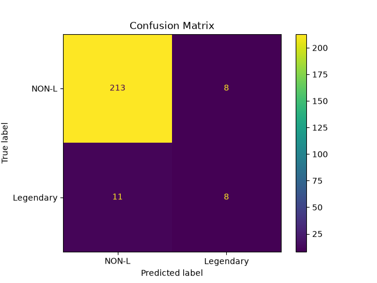

# Naive Bayes — Pokémon Classification

A simple machine learning experiment using **Gaussian Naive Bayes** to predict whether a Pokémon is **Legendary** or **Non-Legendary** based on its base stats.

This project is part of my journey learning machine learning algorithms from the fundamentals.

---

## What is Naive Bayes?

**Naive Bayes** is a supervised machine learning algorithm primarily used for classification.

It is based on **Bayes' Theorem**, which calculates the probability of a class given some observed evidence.

The basic idea is:

> Given these features, which class is most likely?

For example:

```text
Pokémon Stats
     ↓
HP
Attack
Defense
Speed
     ↓
Naive Bayes
     ↓
┌──────────────────────┐
│ Legendary            │
│ Non-Legendary        │
└──────────────────────┘
```

---

## Bayes' Theorem

The core of Naive Bayes comes from Bayes' Theorem:

```text
                 P(B | A) × P(A)
P(A | B) = ─────────────────────────
                    P(B)
```

Where:

* `P(A | B)` = Probability of A given B
* `P(B | A)` = Probability of B given A
* `P(A)` = Prior probability of A
* `P(B)` = Probability of B

In classification, we can think of it as:

```text
Probability of Class given Features
```

---

## Why is it called "Naive"?

The algorithm makes a strong assumption:

> **The features are conditionally independent given the class.**

For example, suppose we have:

```text
HP
Attack
Defense
Speed
```

Naive Bayes assumes these features can be treated independently when calculating the probability of a class.

In reality, Pokémon stats can be related to each other.

That's why the assumption is called **naive**.

Despite this simplification, Naive Bayes can work surprisingly well on many classification problems.

---

# Gaussian Naive Bayes

This project uses:

```python
from sklearn.naive_bayes import GaussianNB
```

Gaussian Naive Bayes is designed for **continuous numerical features**.

It assumes that the values of each feature within each class approximately follow a **Gaussian (normal) distribution**.

The Gaussian probability density function is:

```text
                 1
P(x | C) = ──────────────── × e^(-((x - μ)² / (2σ²)))
            √(2πσ²)
```

Where:

* `x` = observed feature value
* `μ` = mean of the feature for the class
* `σ²` = variance of the feature for the class

The Gaussian calculation gives us the likelihood:

```text
P(feature | class)
```

Naive Bayes then combines the likelihoods of the different features.

---

## How Naive Bayes Makes a Prediction

For multiple features, the classifier conceptually calculates:

```text
P(Class | Features)
        ∝
P(Class)
×
P(Feature 1 | Class)
×
P(Feature 2 | Class)
×
P(Feature 3 | Class)
...
```

For this Pokémon project:

```text
P(Legendary | Stats)
        ∝
P(Legendary)
×
P(HP | Legendary)
×
P(Attack | Legendary)
×
P(Defense | Legendary)
×
P(Speed | Legendary)
```

The same calculation is performed for `Non-Legendary`.

The class with the higher probability becomes the prediction.

---

# Dataset

The dataset contains approximately **800 Pokémon**.

The target variable is:

```text
Legendary
```

The model uses Pokémon base stats as input features.

### Features

```text
HP
Attack
Defense
Speed
```

The target is:

```text
Legendary
```

with two possible classes:

```text
False → Non-Legendary
True  → Legendary
```

---

# Implementation

```python
import pandas as pd

from sklearn.naive_bayes import GaussianNB
from sklearn.model_selection import train_test_split
from sklearn.metrics import classification_report
from sklearn.metrics import accuracy_score
from sklearn.metrics import confusion_matrix
from sklearn.metrics import ConfusionMatrixDisplay

import matplotlib.pyplot as plt


df = pd.read_csv("../04-data-science/data-bases/pokemon.csv")


X = df[
    [
        "HP",
        "Attack",
        "Defense",
        "Speed",
    ]
]

y = df["Legendary"]


X_train, X_test, y_train, y_test = train_test_split(
    X,
    y,
    test_size=0.3,
    random_state=42,
    stratify=y
)


gnb = GaussianNB()

y_pred = gnb.fit(X_train, y_train).predict(X_test)


print(f"Predictions: {y_pred}")

print(f"\n{classification_report(y_test, y_pred)}")

print(f"Accuracy: {accuracy_score(y_test, y_pred)}")


cm = confusion_matrix(y_test, y_pred)

print("Confusion Matrix:")
print(cm)


TN, FP, FN, TP = cm.ravel()

print("\nTrue Negative:", TN)
print("False Positive:", FP)
print("False Negative:", FN)
print("True Positive:", TP)


display = ConfusionMatrixDisplay(
    confusion_matrix=cm,
    display_labels=["NON-L", "Legendary"]
)

display.plot()

plt.title("Confusion Matrix")
plt.show()
```

---

# Train/Test Split

The dataset is divided into:

```text
70% → Training
30% → Testing
```

This is done using:

```python
train_test_split(
    X,
    y,
    test_size=0.3,
    random_state=42,
    stratify=y
)
```

### Why `stratify=y`?

The dataset contains significantly fewer Legendary Pokémon than Non-Legendary Pokémon.

Using:

```python
stratify=y
```

keeps a similar class distribution in both the training and testing datasets.

---

# Class Imbalance

One of the biggest challenges in this dataset is **class imbalance**.

The test set contained:

```text
Non-Legendary → 221
Legendary     → 19
```

So approximately:

```text
92% → Non-Legendary
 8% → Legendary
```

This matters because a model can achieve high accuracy simply by predicting the majority class most of the time.

For example, a model that predicts:

```text
Every Pokémon → Non-Legendary
```

would achieve:

```text
221 / 240 = 92.1%
```

accuracy.

Therefore, **accuracy alone is not enough** for this problem.

---

# Confusion Matrix

The confusion matrix is structured like this:

```text
                 Predicted
                 Non-L   Legendary

Actual Non-L       TN       FP

Actual Legendary   FN       TP
```



Where:

### True Negative (TN)

The Pokémon is Non-Legendary and the model correctly predicts Non-Legendary.

### False Positive (FP)

The Pokémon is Non-Legendary but the model incorrectly predicts Legendary.

### False Negative (FN)

The Pokémon is Legendary but the model incorrectly predicts Non-Legendary.

### True Positive (TP)

The Pokémon is Legendary and the model correctly predicts Legendary.

---

# Initial Model Results

The initial Gaussian Naive Bayes model produced:

```text
              precision    recall    f1-score

False            0.95       0.96       0.96
True             0.50       0.42       0.46

Accuracy: 0.92
```

Confusion matrix:

```text
[[213   8]
 [ 11   8]]
```

Therefore:

```text
True Negative  = 213
False Positive = 8
False Negative = 11
True Positive  = 8
```

The model was very good at identifying Non-Legendary Pokémon but poor at detecting Legendary Pokémon.

---

# Understanding Recall

For the Legendary class:

```text
Recall = TP / (TP + FN)
```

Using the initial model:

```text
Recall = 8 / (8 + 11)

       ≈ 0.421
```

So the model detected approximately:

```text
42.1%
```

of the actual Legendary Pokémon.

That means it missed:

```text
11 out of 19
```

Legendary Pokémon.

---

# Experimenting With Class Priors

Gaussian Naive Bayes allows us to specify class priors.

For example:

```python
gnb = GaussianNB(
    priors=[0.5, 0.5]
)
```

This tells the model to treat the two classes as equally likely before considering the features.

This changed the behavior of the model significantly.

The model became much more willing to predict:

```text
Legendary
```

This increased Legendary recall but also increased false positives.

---

# Final Experiment

One experiment produced:

```text
              precision    recall    f1-score

False            0.99       0.88       0.93
True             0.40       0.95       0.56

Accuracy: 0.88
```

Confusion matrix:

```text
[[194  27]
 [  1  18]]
```

Therefore:

```text
True Negative  = 194
False Positive = 27
False Negative = 1
True Positive  = 18
```

For Legendary Pokémon:

```text
Recall = 18 / (18 + 1)

       ≈ 94.7%
```

The model now detects almost all Legendary Pokémon.

However, it also incorrectly classifies 27 Non-Legendary Pokémon as Legendary.

This demonstrates an important machine learning concept:

> **Increasing recall can come at the cost of precision.**

---

# Precision vs Recall

The results demonstrate the trade-off between precision and recall.

### High precision

When the model predicts:

```text
Legendary
```

it should usually be correct.

### High recall

The model should find as many actual Legendary Pokémon as possible.

In this experiment:

```text
Legendary Precision = 40%
Legendary Recall    = 95%
```

So the model is very good at **finding** Legendary Pokémon but not particularly good at ensuring every Legendary prediction is correct.

---

# Why Accuracy Is Not Enough

The experiments demonstrate why accuracy should not be the only evaluation metric.

For an imbalanced classification problem:

```text
Accuracy
    ↓
Can be misleading
```

Instead, also examine:

```text
Precision
Recall
F1-score
Confusion Matrix
```

Especially for the minority class.

---

# What I Learned

Through this experiment, I learned:

* What Naive Bayes is
* How Bayes' Theorem relates to classification
* Why Naive Bayes is called "naive"
* What Gaussian Naive Bayes is
* How Gaussian probability is used inside Gaussian Naive Bayes
* How to train `GaussianNB` using scikit-learn
* How to use `train_test_split`
* Why `stratify` is useful for imbalanced datasets
* How to read a confusion matrix
* The difference between TP, TN, FP, and FN
* Why accuracy can be misleading
* The difference between precision and recall
* How class priors affect predictions
* The precision/recall trade-off


# Next Steps

Possible improvements and experiments:

* Add `Sp. Atk` and `Sp. Def` features
* Experiment with different class priors
* Experiment with probability thresholds
* Try oversampling techniques such as SMOTE
* Compare Naive Bayes with Decision Tree
* Compare Naive Bayes with Random Forest
* Compare Naive Bayes with KNN
* Compare Naive Bayes with SVM

---

## Conclusion

Gaussian Naive Bayes provides a simple way to perform probabilistic classification using numerical features.

The Pokémon dataset also demonstrates an important real-world machine learning problem: **class imbalance**.

A model can achieve high accuracy while performing poorly on the minority class.

Therefore, evaluating a classification model requires looking beyond accuracy and examining **precision, recall, F1-score, and the confusion matrix**.
