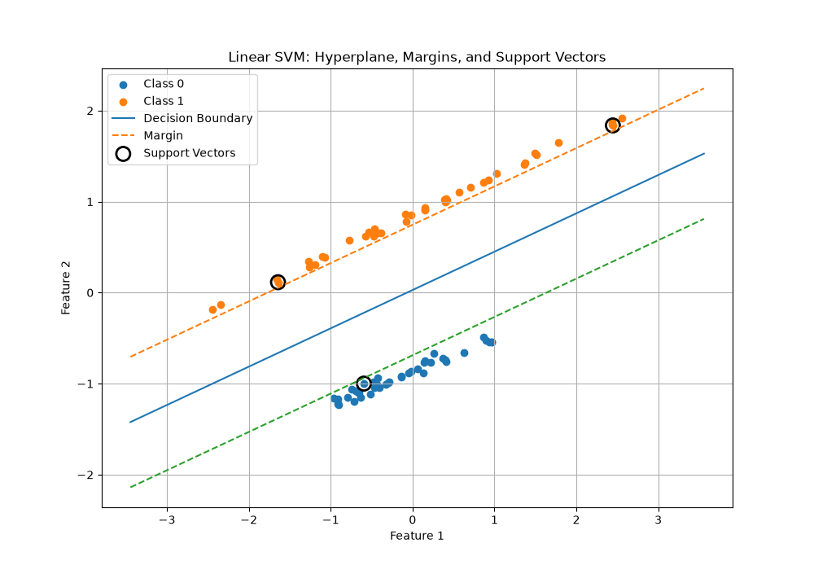

# Support Vector Machines (SVM)

Support Vector Machine (SVM) is a **supervised machine learning algorithm** mainly used for classification.

The main idea behind SVM is simple:

> **Find a decision boundary that separates classes while maximizing the margin between them.**

---

## 📌 What is SVM?

Suppose we have two classes:

```text
🔵 🔵 🔵

🔴 🔴 🔴
```

SVM tries to find a boundary that separates them:

```text
🔵 🔵 🔵

──────────────  ← Decision Boundary

🔴 🔴 🔴
```

The decision boundary is called a **hyperplane**.

For two-dimensional data, the hyperplane is a line.

For higher-dimensional data, it is called a hyperplane.

---

## 📐 Hyperplane

A linear decision boundary can be represented as:

$$
w^Tx+b=0
$$

Where:

* \(w\) = weight vector
* \(x\) = input feature vector
* \(b\) = bias/intercept

For classification:

$$
w^Tx+b > 0
$$

can represent one class, while:

$$
w^Tx+b < 0
$$

represents the other class.

The important point is that **the hyperplane alone isn't the complete SVM idea**.

There can be many hyperplanes that separate the classes.

SVM needs a way to decide which one is best.

---

# 📏 Margin

The **margin** is the distance between the decision boundary and the closest training points from each class.

Conceptually:

```text
Class 0

🔵 🔵 🔵

──────────────  ← Margin Boundary

      ↕
      ↕ Margin
      ↕

──────────────  ← Decision Boundary

      ↕
      ↕ Margin
      ↕

──────────────  ← Margin Boundary

🔴 🔴 🔴

Class 1
```

SVM tries to make this margin as large as possible.

## Some Plots



### Why?

A boundary that is extremely close to the training points can be sensitive to small changes in the data.

A wider margin provides more separation between the classes.

Therefore:

> **SVM chooses the separating hyperplane with the maximum margin.**

---

# 🎯 Support Vectors

The training points closest to the decision boundary are called **Support Vectors**.

```text
🔵 🔵 🔵
      🔵 ← Support Vector

──────────────  ← Margin Boundary

──────────────  ← Decision Boundary

──────────────  ← Margin Boundary

      🔴 ← Support Vector
🔴 🔴 🔴
```

These points are important because they determine the position of the optimal decision boundary and margins.

Points far away from the boundary have much less influence on the final boundary.

This is where the name **Support Vector Machine** comes from.

---

# 📐 SVM Mathematics

The decision boundary is:

$$
w^Tx+b=0
$$

The two margin boundaries are:

$$
w^Tx+b=1
$$

and:

$$
w^Tx+b=-1
$$

The total margin width is:

$$
\boxed{\frac{2}{\|w\|}}
$$

SVM wants to maximize this margin:

$$
\max \frac{2}{\|w\|}
$$

This is mathematically equivalent to minimizing:

$$
\boxed{\frac{1}{2}\|w\|^2}
$$

Therefore, the hard-margin SVM optimization problem is:

$$
\boxed{
\min_{w,b}\frac{1}{2}\|w\|^2
}
$$

subject to:

$$
\boxed{
y_i(w^Tx_i+b)\geq1
}
$$

where:

$$
y_i\in\{-1,+1\}
$$

---

# 🧠 Understanding the Optimization

The important relationship is:

```text
Margin width
     ↓
  2 / ||w||
     ↓
Want margin as large as possible
     ↓
Want ||w|| as small as possible
     ↓
Minimize 1/2 ||w||²
```

So:

$$
\frac{2}{\|w\|}
$$

is the **margin width**, while:

$$
\frac{1}{2}\|w\|^2
$$

is the standard SVM objective in the primal formulation.

---

# ⚠️ Hard Margin vs Soft Margin

Real-world data is rarely perfectly separable.

Some points may fall inside the margin or even on the wrong side of the decision boundary.

A hard-margin SVM requires perfect separation.

A **soft-margin SVM** allows some violations.

Conceptually:

```text
Correct side + outside margin
        ↓
        ✅

Correct side + inside margin
        ↓
        ⚠️ Margin violation

Wrong side of decision boundary
        ↓
        ❌ Misclassification
```

Soft-margin SVM introduces **slack variables**:

$$
\xi_i\geq0
$$

The optimization becomes:

$$
\boxed{
\min_{w,b,\xi}
\frac12\|w\|^2+C\sum_i\xi_i
}
$$

The parameter \(C\) controls how strongly margin violations are penalized.

### Small C

```text
Smaller penalty
      ↓
More tolerance for violations
      ↓
Wider margin may be preferred
```

### Large C

```text
Larger penalty
      ↓
Less tolerance for violations
      ↓
Model tries harder to classify training points correctly
```

---

# 🔄 Linear vs Non-Linear SVM

A **linear SVM** works when the classes can be reasonably separated by a straight decision boundary.

```text
🔵 🔵 🔵

──────────────

🔴 🔴 🔴
```

But some datasets cannot be separated using a straight line.

For example:

```text
      🔴 🔴 🔴
    🔴   🔵   🔴
    🔴 🔵🔵  🔴
      🔴 🔴 🔴
```

A straight line cannot properly separate the classes.

This is where **kernels** are useful.

---

# 🌀 Kernel Trick

The kernel trick allows SVM to handle non-linear relationships by effectively working in a higher-dimensional feature space.

Conceptually:

```text
Original Feature Space
        ↓
   Kernel Function
        ↓
Higher-Dimensional Space
        ↓
Linear Separation
        ↓
Non-Linear Boundary
   in original space
```

Instead of explicitly creating all the new dimensions, kernel methods calculate relationships between data points using a **kernel function**.

---

# 🧩 Common Kernels

## Linear Kernel

```python
SVC(kernel="linear")
```

Creates a linear decision boundary.

---

## Polynomial Kernel

```python
SVC(kernel="poly", degree=3)
```

The polynomial kernel can model polynomial relationships.

The `degree` parameter controls the polynomial degree.

This is similar in spirit to polynomial regression, where higher-degree features allow more complex relationships.

However, polynomial-kernel SVM is still performing **maximum-margin classification**, not regression.

---

## RBF Kernel

```python
SVC(kernel="rbf")
```

RBF stands for **Radial Basis Function**.

It is commonly used for non-linear classification problems.

It can create flexible curved decision boundaries.

---

# 🐍 SVM with Scikit-Learn

A basic linear SVM can be implemented using `LinearSVC`:

```python
from sklearn.svm import LinearSVC

model = LinearSVC()

model.fit(X_train, y_train)

y_pred = model.predict(X_test)
```

---

# 📏 Feature Scaling

SVM is sensitive to feature scales because its optimization depends on distances and the geometry of the feature space.

For example:

```text
Age:       18 → 60

Salary:    20,000 → 2,000,000
```

The different scales can distort the model.

Therefore, feature scaling is usually important.

A pipeline is a clean way to handle this:

```python
from sklearn.pipeline import make_pipeline
from sklearn.preprocessing import StandardScaler
from sklearn.svm import LinearSVC

model = make_pipeline(
    StandardScaler(),
    LinearSVC()
)

model.fit(X_train, y_train)

y_pred = model.predict(X_test)
```

The pipeline performs:

```text
Raw Features
     ↓
StandardScaler
     ↓
Scaled Features
     ↓
LinearSVC
     ↓
Prediction
```

---

# 📊 SVC vs LinearSVC

Scikit-learn provides multiple SVM implementations.

### LinearSVC

```python
from sklearn.svm import LinearSVC

model = LinearSVC()
```

Designed for **linear classification**.

### SVC

```python
from sklearn.svm import SVC

model = SVC(kernel="linear")
```

Can use different kernels:

```python
SVC(kernel="linear")
SVC(kernel="poly")
SVC(kernel="rbf")
SVC(kernel="sigmoid")
```

For learning and visualizing support vectors, `SVC` is particularly useful because it exposes the support vectors directly:

```python
model.support_vectors_
```

---

# 🧪 Simple SVM Example

```python
from sklearn.svm import SVC
from sklearn.pipeline import make_pipeline
from sklearn.preprocessing import StandardScaler
from sklearn.datasets import make_classification

X, y = make_classification(
    n_samples=100,
    n_features=2,
    n_redundant=0,
    n_informative=2,
    random_state=42
)

model = make_pipeline(
    StandardScaler(),
    SVC(kernel="linear")
)

model.fit(X, y)

predictions = model.predict(X)

print(predictions)
```

Using two features makes it possible to visualize the decision boundary, margins, and support vectors.

---

# 📈 SVM Visualization

For a 2D SVM, the important elements are:

```text
                 Class 1

              🔴 🔴 🔴
                 🔴

─────────────── +1 ───────────────
                 ↑
                 │
                 │ Margin
                 │
───────────────  0 ───────────────
                 ↑
                 │
                 │ Margin
                 │
─────────────── -1 ───────────────

              🔵 🔵 🔵
                 🔵

                 Class 0
```

The three lines represent:

```text
+1 → Upper margin boundary

 0 → Decision boundary / hyperplane

-1 → Lower margin boundary
```

The points touching the margin boundaries are the **support vectors**.

---

# 🔑 Key Concepts

```text
Hyperplane
    ↓
Separates the classes

Margin
    ↓
Distance between the decision boundary
and the closest points

Support Vectors
    ↓
Closest points that determine the margin

C
    ↓
Controls penalty for margin violations

Kernel
    ↓
Allows SVM to handle non-linear relationships

Scaling
    ↓
Important because SVM depends on feature geometry
```

---

# 🧠 SVM Mental Model

The easiest way to remember SVM is:

```text
                  SVM

                   ↓

          Find a decision boundary

                   ↓

          Find the closest points

                   ↓

        Create margins around them

                   ↓

       Maximize the margin width

                   ↓

         Support vectors define
             the critical edges

                   ↓

       Use the boundary to classify
             new observations
```

For non-linear data:

```text
Non-linear data
       ↓
     Kernel
       ↓
Higher-dimensional representation
       ↓
Maximum-margin separation
       ↓
Non-linear boundary in original space
```

---

# 📌 Summary

Support Vector Machines are supervised learning algorithms that classify data by finding a **maximum-margin decision boundary**.

The core ideas are:

1. **Hyperplane** — separates the classes.
2. **Margin** — creates a buffer around the decision boundary.
3. **Support vectors** — closest points that determine the margin.
4. **Maximum margin** — SVM tries to maximize the separation between classes.
5. **Soft margin** — allows some points to violate the margin.
6. **C** — controls the penalty for those violations.
7. **Kernels** — allow SVM to model non-linear relationships.
8. **Feature scaling** — usually important for SVM.

The central idea can be summarized as:

$$
\boxed{
\text{Find the decision boundary with the maximum possible margin}
}
$$

