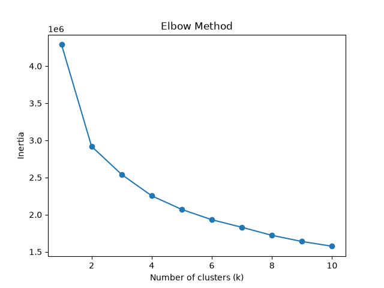
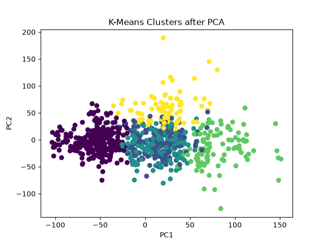

# Unsupervised Learning, K-Means & PCA

## 1. Unsupervised Learning

**Unsupervised Learning** is a type of machine learning where the model is given input data `X` but no target variable `y`.

In supervised learning:

```text
X + y
 ↓
Model
 ↓
Prediction
```

In unsupervised learning:

```text
X
 ↓
Model
 ↓
Patterns / Structure
```

The goal is not to predict a known answer. Instead, the model tries to discover useful structure or patterns hidden inside the data.

### Common Unsupervised Learning Tasks

- **Clustering** — group similar data points together.
- **Dimensionality Reduction** — reduce the number of features while retaining useful information.
- **Anomaly Detection** — identify unusual observations.
- **Association / Pattern Discovery** — find relationships between variables.

Two important techniques covered here are:

- **K-Means** → clustering
- **PCA (Principal Component Analysis)** → dimensionality reduction

---

# 2. K-Means Clustering

**K-Means** is an unsupervised machine learning algorithm used to divide data into `K` clusters.

The algorithm tries to put similar observations into the same cluster.

For example, with Pokémon statistics:

```text
HP
Attack
Defense
Sp. Attack
Sp. Defense
Speed
```

K-Means can group Pokémon with similar overall statistical profiles.

There is no `y` telling K-Means what each group should represent.

---

## How K-Means Works

Suppose we choose:

```python
K = 3
```

K-Means roughly follows these steps:

### Step 1 — Choose K

Choose the number of clusters:

```text
K = 3
```

### Step 2 — Initialize Centroids

K-Means creates `K` initial cluster centers called **centroids**.

### Step 3 — Assign Points

Each data point is assigned to the nearest centroid.

Distance is commonly measured using Euclidean distance:

\[
d(x,c)=\sqrt{\sum_{j=1}^{n}(x_j-c_j)^2}
\]

### Step 4 — Update Centroids

For each cluster, calculate the mean of all points assigned to it.

That mean becomes the new centroid.

### Step 5 — Repeat

The assignment and centroid-update steps continue until the centroids stop changing significantly or the algorithm reaches its iteration limit.

---

# 3. Inertia / WCSS

K-Means tries to keep points close to their cluster centroids.

This is measured using **inertia**, also called **Within-Cluster Sum of Squares (WCSS)**.

\[
\text{Inertia}
=
\sum_{i=1}^{n}
\|x_i-c_i\|^2
\]

Where:

- `x_i` = data point
- `c_i` = centroid of its assigned cluster

Lower inertia means points are, overall, closer to their centroids.

However, simply choosing the `K` with the lowest inertia doesn't work because increasing `K` will generally decrease inertia.

---

# 4. Elbow Method

The **Elbow Method** helps choose a reasonable value of `K`.

We train K-Means with several values of `K` and record the inertia.

```python
from sklearn.cluster import KMeans
import matplotlib.pyplot as plt

inertias = []

for k in range(1, 11):
    model = KMeans(
        n_clusters=k,
        random_state=42,
        n_init="auto"
    )

    model.fit(X)
    inertias.append(model.inertia_)

plt.plot(range(1, 11), inertias, marker="o")
plt.xlabel("Number of clusters (K)")
plt.ylabel("Inertia")
plt.title("Elbow Method")
plt.show()
```

The curve usually decreases as `K` increases.

The **elbow** is the point where increasing `K` starts producing much smaller improvements.

Example:

```text
Inertia
  |
  | *
  |   *
  |      *
  |        *
  |          *  *  *  *
  |________________________
      1  2  3  4  5  6
              ↑
            Elbow
```

The elbow gives a **candidate value** for `K`; it is not a guaranteed mathematically correct answer.

# Elbow Curv Graph



The **Silhouette Score** can also be used to evaluate different values of `K`.

---

# 5. Using K-Means with Scikit-Learn

```python
from sklearn.cluster import KMeans

model = KMeans(
    n_clusters=5,
    random_state=42,
    n_init="auto"
)

labels = model.fit_predict(X)
```

`labels` contains the cluster assigned to each observation.

For example:

```text
[2, 0, 4, 1, 2, 3, ...]
```

The numbers themselves do **not** have an inherent meaning.

Cluster `0` is not necessarily better, stronger, or more important than cluster `1`.

---

## Adding Cluster Labels to a DataFrame

```python
df["Cluster"] = labels
```

Now the cluster can be analyzed along with the original data.

For example:

```python
for cluster in sorted(df["Cluster"].unique()):
    print(f"\nCluster {cluster}")
    print(df[df["Cluster"] == cluster]["Name"].to_list())
```

You can also calculate the average feature values for each cluster:

```python
stats = [
    "HP",
    "Attack",
    "Defense",
    "Sp. Atk",
    "Sp. Def",
    "Speed"
]

print(df.groupby("Cluster")[stats].mean())
```

This helps determine what characteristics the clusters have in common.

---

# 6. Visualizing K-Means Clusters

A normal scatter plot can display only two dimensions.

For example:

```python
plt.scatter(
    X["Attack"],
    X["Defense"],
    c=labels
)

plt.xlabel("Attack")
plt.ylabel("Defense")
plt.title("K-Means Clusters")
plt.show()
```

Here:

```python
c=labels
```

colors the observations according to their cluster.

### Important

If K-Means was trained using six features but the plot shows only two, the visualization is only a **2D view of a higher-dimensional clustering**.

Two clusters may overlap on the plot while still being different when all original features are considered.

---

# 7. Principal Component Analysis (PCA)

**PCA (Principal Component Analysis)** is a dimensionality-reduction technique.

It transforms the original features into a new set of variables called **principal components**.

For example:

```text
Original Data

HP
Attack
Defense
Sp. Attack
Sp. Defense
Speed

        ↓ PCA

PC1
PC2
```

This changes:

```text
6 dimensions → 2 dimensions
```

The goal is to retain as much of the important variation in the data as possible while using fewer dimensions.

---

# 8. What Are Principal Components?

A principal component is a new axis created from a combination of the original features.

Conceptually:

\[
PC_1 =
w_1X_1+w_2X_2+\cdots+w_nX_n
\]

The first principal component, `PC1`, captures the greatest amount of variance.

The second principal component, `PC2`, captures the greatest remaining variance while being orthogonal to `PC1`.

Then:

```text
PC1
PC2
PC3
...
```

can represent the data using a new coordinate system.

PCA does **not** simply select two original columns.

---

# 9. PCA with Scikit-Learn

```python
from sklearn.decomposition import PCA

pca = PCA(n_components=2)

X_pca = pca.fit_transform(X)
```

If the original data has:

```text
800 rows × 6 features
```

then:

```text
X.shape
→ (800, 6)

X_pca.shape
→ (800, 2)
```

The six original features have been transformed into two principal components.

---

# 10. Visualizing K-Means with PCA

A common workflow is:

```text
Original Data
     ↓
Select Features
     ↓
Scale Features
     ↓
K-Means
     ↓
Cluster Labels
     ↓
PCA
     ↓
2D Representation
     ↓
Matplotlib
```

Example:

```python
from sklearn.decomposition import PCA
import matplotlib.pyplot as plt

pca = PCA(n_components=2)

X_pca = pca.fit_transform(X)

plt.scatter(
    X_pca[:, 0],
    X_pca[:, 1],
    c=labels
)

plt.xlabel("PC1")
plt.ylabel("PC2")
plt.title("K-Means Clusters using PCA")
plt.show()
```

This lets us visually inspect a high-dimensional clustering in two dimensions.

---

# PCA Clusters Visualization



---

# 11. Explained Variance

PCA provides an important measurement called the **explained variance ratio**.

```python
print(pca.explained_variance_ratio_)
```

Example:

```text
[0.42, 0.25]
```

This means:

```text
PC1 → 42% of the variance
PC2 → 25% of the variance
```

Together:

```text
42% + 25% = 67%
```

So the two-dimensional representation retains about 67% of the variance in the original data.

You can calculate it with:

```python
print(pca.explained_variance_ratio_.sum())
```

A higher value generally means the 2D representation preserves more of the original variation.

---

# 12. Feature Scaling

Scaling is especially important for distance-based algorithms such as K-Means and for PCA.

Suppose one feature ranges from:

```text
0–100
```

while another ranges from:

```text
0–1,000,000
```

The larger-scale feature can dominate calculations.

A common solution is `StandardScaler`:

```python
from sklearn.preprocessing import StandardScaler

scaler = StandardScaler()

X_scaled = scaler.fit_transform(X)
```

Then use:

```python
X_scaled
```

for K-Means and PCA when appropriate.

---

# 13. K-Means vs PCA

| Technique | Main Purpose | Output |
|---|---|---|
| K-Means | Clustering | Cluster assignments |
| PCA | Dimensionality reduction | Principal components |

K-Means answers:

> "Which observations are similar enough to group together?"

PCA answers:

> "Can I represent this high-dimensional data using fewer dimensions while retaining important variation?"

They can be used together, but they solve different problems.

---

# 14. Practical Example: Pokémon

Suppose the dataset contains:

```text
HP
Attack
Defense
Sp. Atk
Sp. Def
Speed
```

A possible workflow is:

```python
import pandas as pd
import matplotlib.pyplot as plt

from sklearn.cluster import KMeans
from sklearn.preprocessing import StandardScaler
from sklearn.decomposition import PCA

df = pd.read_csv("pokemon.csv")

features = [
    "HP",
    "Attack",
    "Defense",
    "Sp. Atk",
    "Sp. Def",
    "Speed"
]

X = df[features]

# Scale
scaler = StandardScaler()
X_scaled = scaler.fit_transform(X)

# K-Means
kmeans = KMeans(
    n_clusters=5,
    random_state=42,
    n_init="auto"
)

labels = kmeans.fit_predict(X_scaled)

# Store clusters
df["Cluster"] = labels

# PCA for visualization
pca = PCA(n_components=2)

X_pca = pca.fit_transform(X_scaled)

# Plot
plt.scatter(
    X_pca[:, 0],
    X_pca[:, 1],
    c=labels
)

plt.xlabel("PC1")
plt.ylabel("PC2")
plt.title("Pokémon K-Means Clusters")
plt.show()
```

After clustering, inspect the groups:

```python
print(df.groupby("Cluster")[features].mean())
```

and inspect which Pokémon belong to each group:

```python
for cluster in sorted(df["Cluster"].unique()):
    print(f"\nCluster {cluster}")
    print(df[df["Cluster"] == cluster]["Name"].to_list())
```

This allows you to investigate what characteristics distinguish the discovered groups.

---

# Key Takeaways

### Unsupervised Learning

```text
X only
 ↓
Find hidden structure
```

There is no predefined `y`.

### K-Means

```text
X
 ↓
Choose K
 ↓
Find centroids
 ↓
Assign points
 ↓
Update centroids
 ↓
Repeat
 ↓
Clusters
```

### Elbow Method

```text
Try multiple K values
 ↓
Calculate inertia
 ↓
Plot K vs inertia
 ↓
Find elbow
 ↓
Choose a candidate K
```

### PCA

```text
Many features
 ↓
Find directions of maximum variance
 ↓
Create principal components
 ↓
Represent data with fewer dimensions
```

### K-Means + PCA

```text
High-dimensional data
       ↓
   K-Means
       ↓
Cluster labels
       ↓
      PCA
       ↓
    2D plot
       ↓
Visual inspection
```

The key distinction is:

> **K-Means discovers groups. PCA makes high-dimensional data easier to represent and visualize.**
